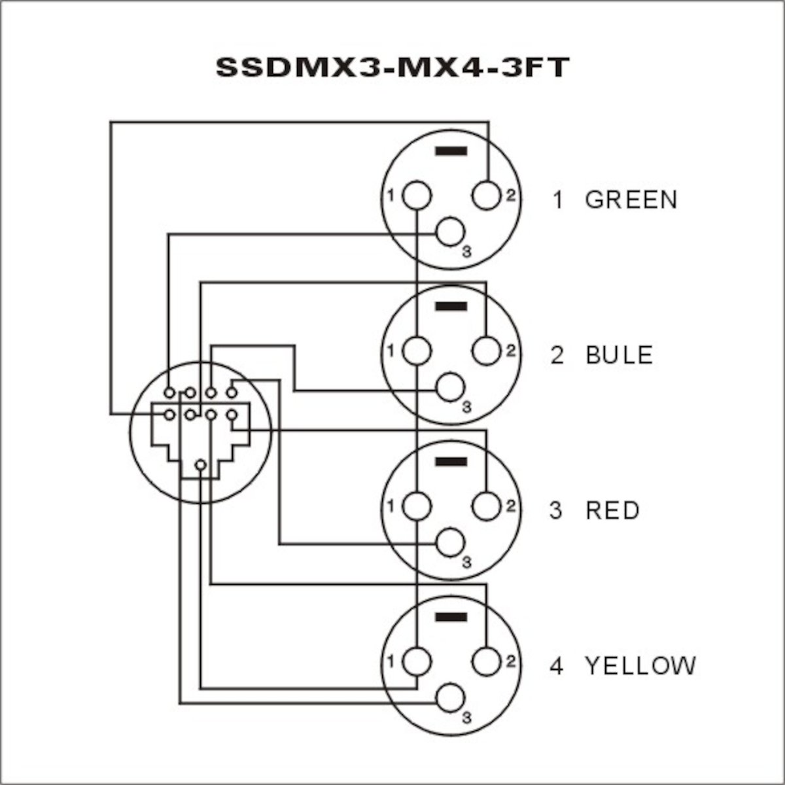

# Audio

## [AES - Audio Engineering Society](https://aes2.org/)

## [EBU - European Broadcast Union](https://www.ebu.ch/)

## Computer - Audio Card Standards

### XLR over CAT 5/6/7

## Balanced

### XLR

#### XLR - Jack

## Unbalanced

